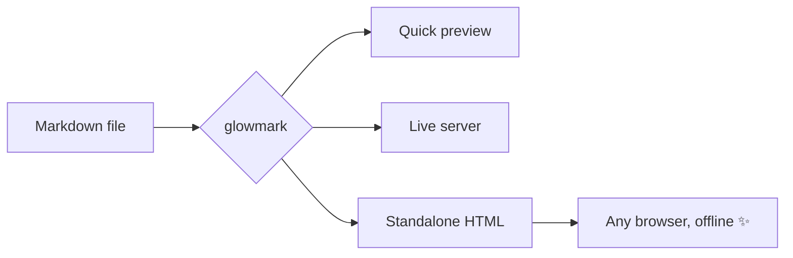

# Welcome to glowmark

glowmark turns **one markdown file** into a polished, standalone HTML page — with
syntax highlighting, a scroll-spy table of contents, light/dark themes, and a
live-reload preview server. This page was rendered by a single command:

```bash
glowmark --serve examples/demo.md
```

## Why?

Because sharing a README as raw text is *fine*, but sharing it as a beautiful
page is **better**. One task, done well.[^1]

## Code highlighting

Server-side highlighting via Pygments — no JavaScript needed:

```python
from dataclasses import dataclass

@dataclass
class Glow:
    name: str
    intensity: float = 1.0

    def shine(self) -> str:
        return f"{self.name} {'✨' * int(self.intensity * 5)}"


if __name__ == "__main__":
    print(Glow("glowmark", 0.9).shine())
```

```javascript
const render = async (path) => {
  const md = await Deno.readTextFile(path);
  return md.replace(/^#\s+(.*)/m, "<h1>$1</h1>");
};
```

## Tables

| Feature          | Command                | Needs network |
| ---------------- | ---------------------- | ------------- |
| Quick preview    | `glowmark doc.md`      | No            |
| Live reload      | `glowmark -s doc.md`   | No            |
| Standalone file  | `glowmark doc.md -o x.html` | No       |
| Math (KaTeX)     | automatic              | First load    |
| Mermaid diagrams | automatic              | First load    |

## GitHub-style alerts

> [!NOTE]
> Useful information that users should know, even when skimming.

> [!TIP]
> Helpful advice for doing things better or differently.

> [!WARNING]
> Urgent info that needs immediate user attention to avoid problems.

> [!IMPORTANT]
> Key information users need to know to achieve their goal.

## Task lists

- [x] Parse markdown
- [x] Highlight code with Pygments
- [x] Build live-reload server
- [ ] Take over the world

## Math

Inline math like $e^{i\pi} + 1 = 0$ and display math:

$$
\int_{-\infty}^{\infty} e^{-x^2} \, dx = \sqrt{\pi}
$$

## Mermaid diagram



## Footnotes

Footnotes render at the bottom of the page, styled neatly.[^2]

---

*Edit this file while `--serve` is running and watch your browser refresh itself.*

[^1]: Word count and reading time in the header are computed for you.
[^2]: They even support **markdown** inside them.
